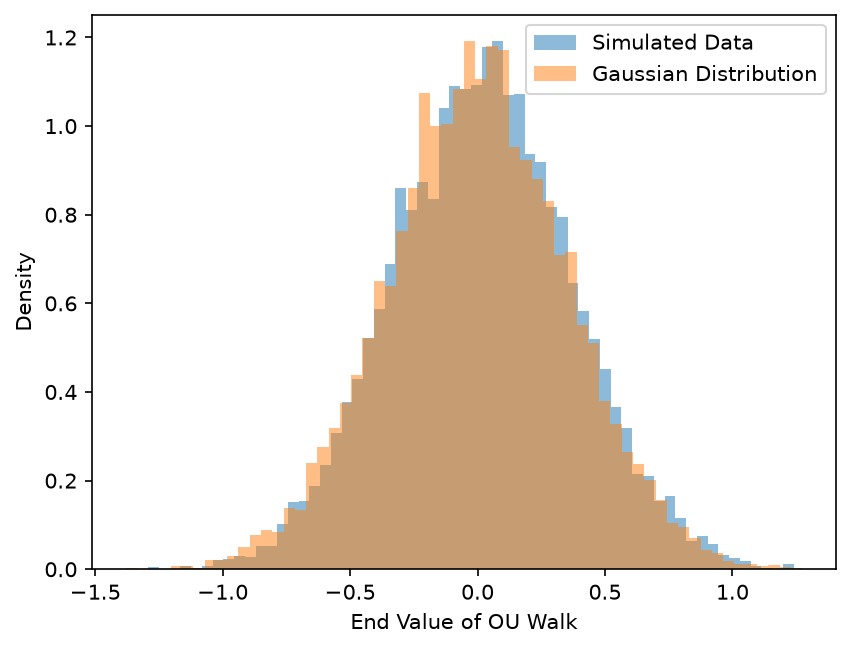

# Ornstein–Uhlenbeck Process Simulation
https://tutkankuzey.github.io/ou-langevin-project/web/

Numerical simulation of the Ornstein–Uhlenbeck process — the continuous-time
mean-reverting stochastic process underlying the Vasicek interest-rate model and
the Langevin equation for a particle in a harmonic potential — with empirical
validation of its stationary distribution against theory.

## The problem

The OU process is defined by the stochastic differential equation

$$dX_t = \theta(\mu - X_t)\,dt + \sigma\,dW_t$$

where $\theta > 0$ is the mean-reversion rate, $\mu$ the long-run mean, $\sigma$
the volatility, and $W_t$ a standard Wiener process. The drift term pulls the
process toward $\mu$ at a rate proportional to its distance from it; the
diffusion term pushes it around at random.

The process admits a stationary distribution

$$X_\infty \sim \mathcal{N}\!\left(\mu,\ \frac{\sigma^2}{2\theta}\right)$$

This repository integrates the SDE numerically and checks that the empirical
distribution of simulated endpoints converges to that law — a test of both the
integrator and the theory it is meant to reproduce.

## Method

**Brownian motion.** Sample paths are built from independent Gaussian increments

$$W_{t+\Delta t} - W_t \sim \mathcal{N}(0, \Delta t)$$

giving a discretized Wiener process on a fixed time grid.

**Euler–Maruyama integration.** The SDE is discretized as

$$X_{n+1} = X_n + \theta(\mu - X_n)\Delta t + \sigma\sqrt{\Delta t}\,Z_n,
\qquad Z_n \sim \mathcal{N}(0,1)$$

Euler–Maruyama is the stochastic analogue of the forward Euler scheme. It
converges at order $1/2$ in the strong sense and order $1$ in the weak sense —
weaker than deterministic Euler, because the Brownian increments are only
Hölder-$\tfrac{1}{2}$ continuous.

**Validation.** $10{,}000$ independent paths are simulated to a horizon long
enough for the transient to decay. The empirical mean and variance of the
endpoints are compared against $\mu$ and $\sigma^2/2\theta$, and the empirical
density is plotted against the theoretical Gaussian.

## Results

The endpoint distribution matches the theoretical stationary law.

Parameters: $\theta = 1.0$, $\mu = 0$, $\sigma = 0.5$, $\Delta t = 0.02$, $T = 20$, $M = 10{,}000$ paths.

| Quantity | Theoretical | Euler–Maruyama | Simulated |
|----------|-------------|----------------|-----------|
| Mean     | 0           | 0              | −0.0022 (SE 0.0035) |
| Variance | 0.1250      | 0.1263         | 0.1281    |

The empirical mean is 0.6 standard errors from $\mu$. The variance sits 1.1 standard
errors above the Euler–Maruyama stationary variance
$\sigma^2\Delta t\,/\,[1-(1-\theta\Delta t)^2] = 0.1263$, which exceeds the continuous-time
value by $O(\Delta t)$ — the discretization bias, not sampling error.



## Repository layout

```
src/          simulation and integration code
notebooks/    exploratory walkthrough of the derivation and results
figures/      generated plots
web/          browser visualization of sample paths
data/         generated output (not tracked)
```

## Running it

```bash
python -m venv venv
source venv/bin/activate
pip install -r requirements.txt
python src/ou_process.py
```
Or open `notebooks/01_brownian_motion.ipynb` for the annotated walkthrough.